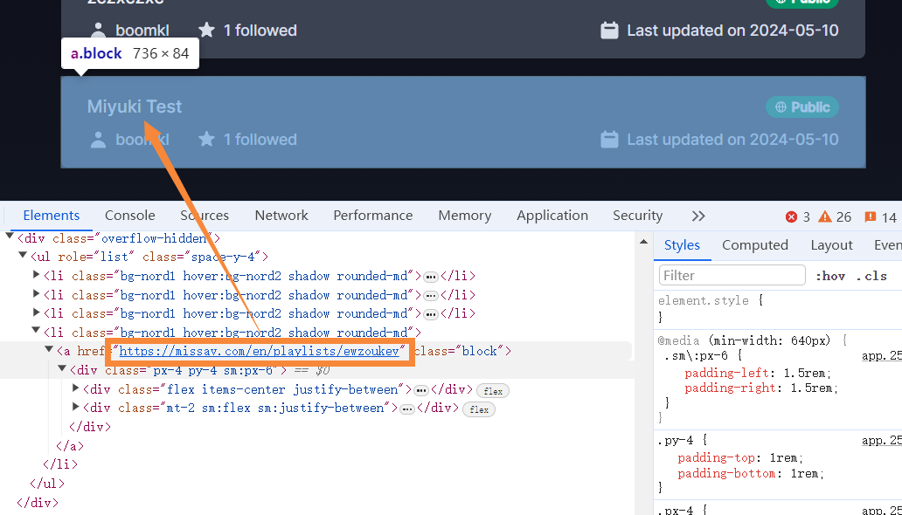

type 1 : custom urls, change movie_urls into yourself

type 2 : login your account and download movies from your movie collections

type 3 : download from a public playlist url

Due to the m3u8 fragment download, the more CPU logical threads there are, the faster the download speed

ps: If you are from an ancient eastern country, then you may need to use a network proxy